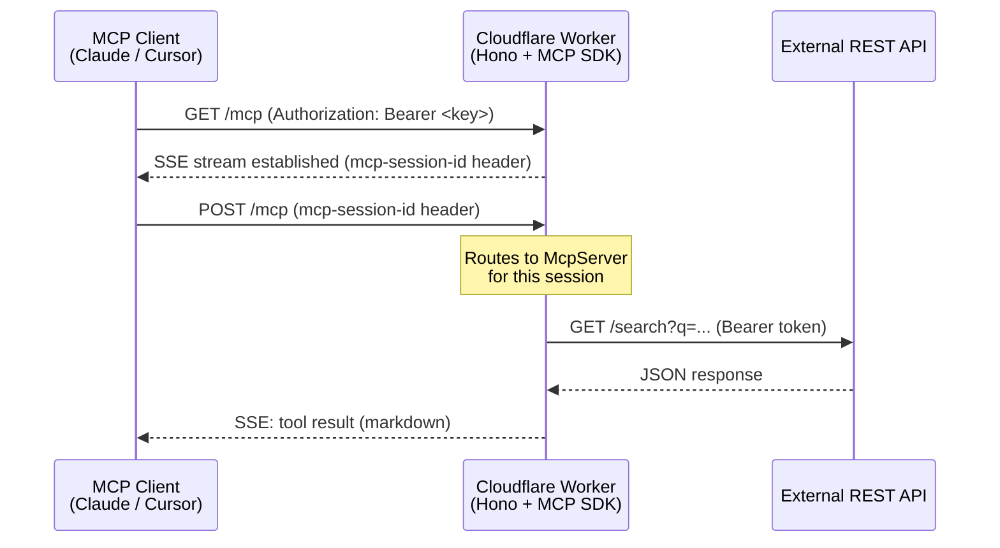

<div align="center">
  

  <h1>MCP Server Template</h1>
  <p><strong>Bridge any REST API to the Model Context Protocol — deployed on the Cloudflare Workers Edge.</strong></p>

  [](https://github.com/PCWProps/mcp-server-template/actions/workflows/ci.yml)
  [](https://opensource.org/licenses/MIT)
  [](https://www.typescriptlang.org/)
  [](https://workers.cloudflare.com/)
  [](https://pnpm.io/)
  [](https://github.com/modelcontextprotocol/sdk)
</div>

---

## Mission

This template gives you everything you need to expose **any REST API** as a set of [Model Context Protocol (MCP)](https://modelcontextprotocol.io/) tools, resources, and prompts — running globally on the **Cloudflare Workers edge** with zero cold-starts, sub-millisecond latency, and automatic scaling.

Connect Claude Desktop, Cursor, Continue.dev, or any MCP-compatible AI client to your API in minutes.

---

## Table of Contents

- [Architecture](#architecture)
- [Quickstart](#quickstart)
- [Project Structure](#project-structure)
- [Adding MCP Capabilities](#adding-mcp-capabilities)
- [Ingesting API Docs](#ingesting-api-docs-openapi-script)
- [Configuration](#configuration)
- [Deployment](#deployment)
- [Roadmap](#roadmap)
- [Sponsorship](#sponsorship)
- [Contributing](#contributing)
- [License](#license)

---

## Architecture



**Key design decisions:**
- **Streamable HTTP transport** — uses the MCP SDK's `WebStandardStreamableHTTPServerTransport` with native Cloudflare Workers Web Streams API
- **Per-session isolation** — each `GET /mcp` creates an independent `McpServer` instance
- **Auth middleware** — timing-safe Bearer token check guards all MCP endpoints
- **Retry + timeout** — `ApiClient` handles 429/5xx with exponential backoff automatically

---

## Quickstart

### Prerequisites

| Tool | Version |
|------|---------|
| Node.js | >= 18.x |
| pnpm | >= 8.x |
| Wrangler | >= 3.x |

### 1. Clone and Install

```bash
# Use this template (GitHub)
gh repo create my-mcp-server --template PCWProps/mcp-server-template --private
cd my-mcp-server

# Install dependencies
pnpm install
```

### 2. Configure Environment

```bash
# Copy the example vars file
cp .dev.vars.example .dev.vars
```

Edit `.dev.vars`:

```ini
TARGET_API_BASE_URL=https://api.example.com
TARGET_API_KEY=your-api-key-here
MCP_AUTH_KEY=your-mcp-auth-key-here
```

> **Generate a secure MCP_AUTH_KEY:**
> ```bash
> openssl rand -hex 32
> ```

### 3. Start Development Server

```bash
pnpm dev
# Wrangler starts at http://localhost:8787
```

### 4. Test the MCP Connection

```bash
# Health check
curl http://localhost:8787/health

# Connect to MCP streamable HTTP endpoint (SSE stream)
curl -N \
  -H "Authorization: Bearer your-mcp-auth-key" \
  http://localhost:8787/mcp
```

### 5. Connect an MCP Client

Add to your **Claude Desktop** `claude_desktop_config.json`:

```json
{
  "mcpServers": {
    "my-api": {
      "url": "http://localhost:8787/mcp",
      "headers": {
        "Authorization": "Bearer your-mcp-auth-key"
      }
    }
  }
}
```

---

## Project Structure

```
mcp-server-template/
├── src/
│   ├── index.ts              # Hono app + SSE/message routing
│   ├── mcp/server.ts         # McpServer factory
│   ├── tools/                # MCP tool implementations
│   ├── resources/            # MCP resource implementations
│   ├── prompts/              # MCP prompt templates
│   ├── api/client.ts         # Type-safe HTTP client with retry
│   ├── middleware/auth.ts    # Bearer token auth middleware
│   └── types/env.d.ts        # Cloudflare Worker env bindings
├── scripts/
│   └── ingest-openapi.ts     # OpenAPI → MCP tool generator
├── .github/                  # GitHub workflows, templates, policies
├── .devcontainer/            # VS Code Dev Container config
├── wrangler.toml             # Cloudflare Workers config
└── package.json
```

---

## Adding MCP Capabilities

### New Tool

```typescript
// src/tools/my-tool.ts
import { z } from 'zod';
import type { McpServer } from '@modelcontextprotocol/sdk/server/mcp.js';
import type { ApiClient } from '../api/client.js';

export function registerMyTool(server: McpServer, client: ApiClient): void {
  server.tool(
    'my_tool',
    'Description for the AI',
    { query: z.string().describe('Search query') },
    async ({ query }) => {
      const result = await client.get('/endpoint', { q: query });
      return { content: [{ type: 'text', text: `Result: ${JSON.stringify(result)}` }] };
    },
  );
}
```

Then register in `src/tools/index.ts`. See [CONTRIBUTING.md](.github/CONTRIBUTING.md) for the full walkthrough.

---

## Ingesting API Docs (OpenAPI Script)

Have an OpenAPI 3.x spec? Auto-generate tool skeletons in seconds:

```bash
# Place your spec in the project root
cp /path/to/openapi.json ./openapi.json

# Run the ingestion script
pnpm ingest-openapi

# Review and customize generated files in src/tools/
# Then register them in src/tools/index.ts
```

The script generates:
- A **Zod schema** from the OpenAPI parameters
- A typed **ApiClient call** stub
- Markdown-formatted response template
- Full **JSDoc documentation**

---

## Configuration

### Environment Variables

| Variable | Description | Required |
|----------|-------------|----------|
| `TARGET_API_BASE_URL` | Base URL of the external API | ✅ |
| `TARGET_API_KEY` | API key for the external API | ✅ |
| `MCP_AUTH_KEY` | Key that MCP clients must present | ✅ |

Set secrets for production:

```bash
wrangler secret put TARGET_API_KEY
wrangler secret put MCP_AUTH_KEY
```

---

## Deployment

### Deploy to Cloudflare Workers

```bash
# One-command deploy
pnpm deploy

# Deploy to staging environment
pnpm deploy:staging
```

### CI/CD (GitHub Actions)

The included workflows automate:
- **CI** — lint, typecheck, and test on every push/PR (Node 18, 20, 22)
- **Deploy** — automatically deploys to Cloudflare on every push to `main`
- **Release** — changesets-based changelog and GitHub Releases

Add these secrets to your GitHub repository:
- `CLOUDFLARE_API_TOKEN`
- `CLOUDFLARE_ACCOUNT_ID`

---

## Roadmap

- [x] SSE transport for Cloudflare Workers
- [x] Bearer token auth middleware
- [x] Type-safe ApiClient with retry/timeout
- [x] OpenAPI ingestion script
- [x] Example tool, resource, and prompt
- [ ] Durable Objects support for multi-instance session state
- [ ] OAuth 2.0 / API key rotation support
- [ ] Rate limiting middleware
- [ ] Streaming tool responses (chunked SSE)
- [ ] Tool result caching via KV
- [ ] Multi-tenant support (per-user API keys)
- [ ] Wrangler AI (Workers AI) integration example
- [ ] Metrics and observability dashboard

---

## Sponsorship

If this template saves you time, consider supporting continued development:

<div align="center">

[](https://github.com/sponsors/PCWProps)
[](https://patreon.com/maintainer)
[](https://ko-fi.com/maintainer)

</div>

Your sponsorship funds:
- Keeping dependencies up to date
- Writing tutorials and documentation
- Building new example integrations
- Responding to issues quickly

---

## Contributing

Contributions are welcome! Please read the [Contributing Guidelines](.github/CONTRIBUTING.md) before submitting a PR.

- 🐛 [Report a Bug](.github/ISSUE_TEMPLATE/bug_report.yml)
- 🚀 [Request a Feature](.github/ISSUE_TEMPLATE/feature_request.yml)
- 🔧 [Request an API Tool](.github/ISSUE_TEMPLATE/api_tool_request.yml)
- 💬 [GitHub Discussions](../../discussions)

---

## License

[MIT](LICENSE) © [PCWProps](https://github.com/PCWProps)
